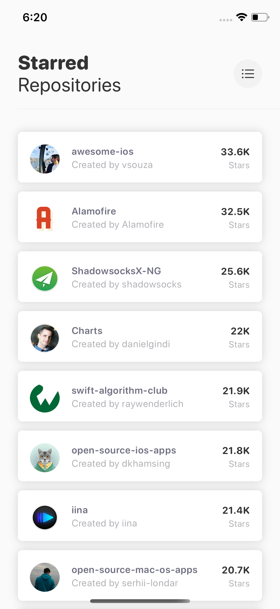
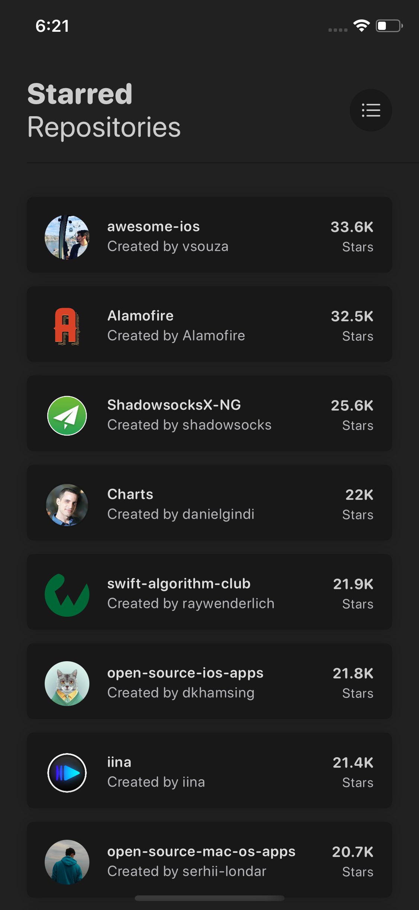
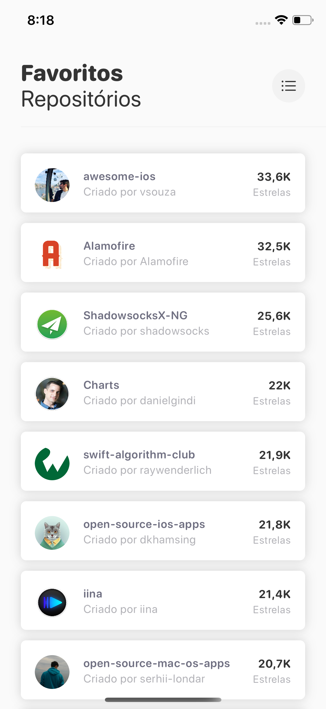
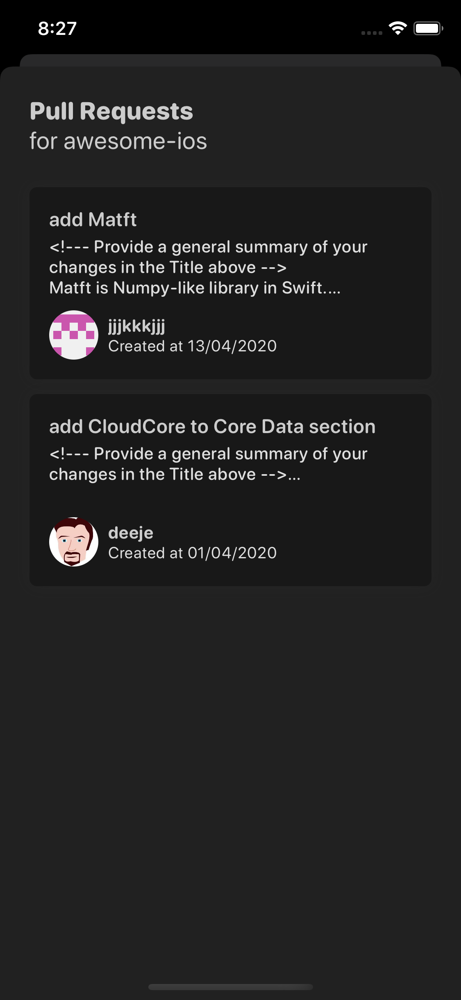

<p align="center">
    
</p>

<p align="center">
    
    
    <a href="https://cocoapods.org">
        
    </a>
     
    <a href="https://twitter.com/leandroromn" target="_blank">
        
    </a>
</p>

Welcome to **AmazingRepositories**, a simple iOS application to list recency, starred and forked repositories using GitHub API.

## Light and Dark Mode
AmazingRepository supports light mode and dark mode natively with iOS 13.

<p align="center">
    
    
</p>

## Repository Filters and Internationalization
Choose between recency, number of forks or number of stars filters to display repositories.<br/>
Also, you can use AmazingRepositories in English 🇺🇸 or Portuguese 🇧🇷.

<p align="center">
    
    
</p>

## Pull Requests
Select a repository to see the latest pull requests with a short description and author information.
<p align="center">
    
    
</p>

## Architecture and third-party libraries
This project was built using **Clean Swift** architecture, a **native and generic network layer** and manage third-party dependencies with **CocoaPods**:
- **PromiseKit**: An alternative to simplify asynchronous tasks for Swift and ObjC.
- **Kingfisher**: A library for downloading and caching images from external sources.
- **Nimble**: An alternative to improve test assertions.
- **Quick**: A library for behavior-driven development tests.
- **Nimble-Snapshots**: A Nimble matchers for iOSSnapshotTestCase.
- **KIF**: A functional testing framework for interface tests.

## Accessibility
**AmazingRepositories** gained resources to improve the experience for users who need accessibility. Enable the **VoiceOver** feature to get more information about repositories and pull requests. Natively supported for English and Portuguese.
<br/>
***How do I activate VoiceOver?***
<br/>
- Open the Settings app;
- Tap *Accessibility* option;
- Enable *VoiceOver* switch.

## Installation
To build and run this project, follow the commands below:
```
$ git clone https://github.com/leandroromn/AmazingRepositories.git
$ cd AmazingRepositories
$ pod install
```

### Development Environment
These were the versions of systems and tools used to develop the latest version of **AmazingRepositories**:
- **Xcode** 11.4
- **Swift** 5.2
- **CocoaPods** 1.9.1
- **iOS** 13.4.1
- **macOS** 10.15.4

## Unit, Snapshot and Functional Tests
This project has unit, snapshot and functional (interface) tests. You can run all tests with `CMD + U` in **Xcode** or use **Slather** to get the test coverage reports.

Also, you can run a configured lane from **Fastlane** to use **Slather** in this project:
```
$ fastlane tests
```

There's a command to run **Slather** without **Fastlane**, if you prefer:
```
$ slather coverage --html --show --scheme AmazingRepositories --workspace AmazingRepositories.xcworkspace AmazingRepositories.xcodeproj
```

[Click here](https://github.com/SlatherOrg/slather#installation) to read more and install **Slather** in your machine.

#### Known issues:
- **Slather**: [Fail test code coverage not found coverage directory. #418](https://github.com/SlatherOrg/slather/issues/418)<br/>
There's a problem with Fastlane and Slather together. When Slather is executed, the tool cannot find the test coverage directory and returns an error. If this happens to you, run the Slather's command without Fastlane.
