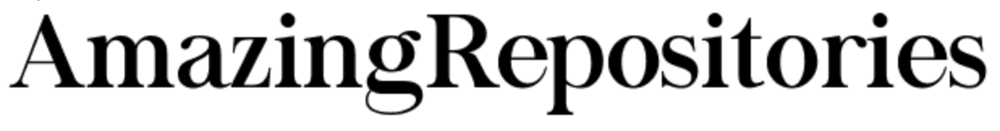
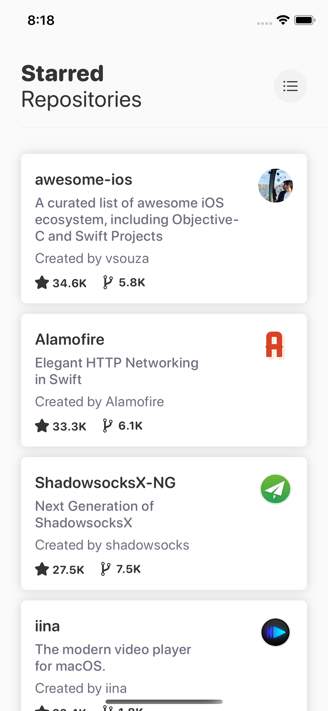
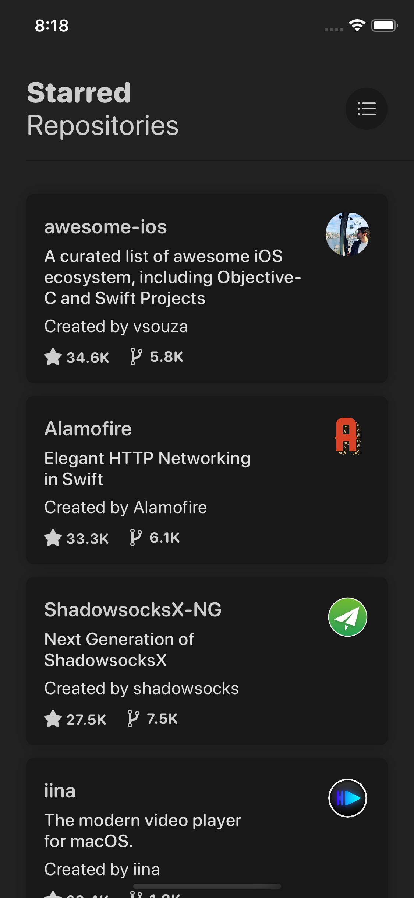

    

    
    
    
     
    

Welcome to **AmazingRepositories**, a simple iOS application to list recency, starred and forked repositories using GitHub API.

## Light and Dark Mode
AmazingRepository supports light mode and dark mode natively with iOS 13.

    
    

